# Magic Counter 2 - Application Structure

## Visual Architecture Diagram


_Interactive diagram (Mermaid):_

```mermaid
graph TB
    subgraph "Entry Point"
        MAIN[main.tsx]
        MAIN --> APP[App.tsx]
        MAIN --> ERROR[ErrorBoundary]
    end

    subgraph "Context Providers"
        APP --> APP_CONTENT[AppContent]
        APP_CONTENT --> USERS_PROV[UsersProvider]
        USERS_PROV --> GAMES_PROV[GamesProvider]
        GAMES_PROV --> DECKS_PROV[DecksProvider]
    end

    subgraph "Main Components"
        APP_CONTENT --> APP_MAIN[AppMain]
        APP_MAIN --> BOARD[Board]
        APP_MAIN --> INTRO[IntroScreen]
        APP_CONTENT --> DEV_TOOLS[DevToolsPanel]
        APP_CONTENT --> PWA[PWAInstallPrompt]
    end

    subgraph "Board Component & Children"
        BOARD --> GAME_FORM[GameForm]
        BOARD --> GAME_STATUS[GameStatus]
        BOARD --> SORTABLE_PLAYERS[SortablePlayerSection]
        BOARD --> ACTIONS_LIST[ActionsList]
        BOARD --> GAME_END_MODAL[GameEndModal]
        BOARD --> INTRO_MODAL[IntroScreen Modal]
        BOARD --> MONARCH_REMINDER[MonarchDrawReminder]
        BOARD --> START_GAME_MODAL[StartGameModal]

        SORTABLE_PLAYERS --> PLAYER_SECTION[PlayerSection]
        PLAYER_SECTION --> PLAYER_LIFE[PlayerLifeControls]
        PLAYER_SECTION --> PLAYER_DECK[PlayerDeckSelector]
        PLAYER_SECTION --> PLAYER_USER[PlayerUserSelector]
        PLAYER_SECTION --> COMMANDER[Commander]
        PLAYER_SECTION --> COMMANDER_DAMAGE[CommanderDamage]
        PLAYER_SECTION --> POISON[PoisonCounters]
        PLAYER_SECTION --> MONARCH_TOGGLE[MonarchToggle]
        PLAYER_SECTION --> MANA_PICKER[ManaPicker]
    end

    subgraph "Game Management"
        INTRO --> GAMES[Games]
        GAMES --> GAME[Game]
        GAME --> LIFE_CHART[LifeChart]
        GAME --> DAMAGE_CHART[DamageChart]
        GAME --> ROUND_CHART[RoundDurationChart]
        GAME --> ACTIONS_LIST2[ActionsList]
    end

    subgraph "Deck Management"
        INTRO --> DECKS[Decks]
        DECKS --> DECK[Deck]
        DECKS --> DECK_FORM[DeckForm]
        DECK_FORM --> COMMANDER_SEARCH[CommanderSearch]
    end

    subgraph "User Management"
        INTRO --> USERS[Users]
        USERS --> USER[User]
        USERS --> USER_FORM[UserForm]
        PLAYER_USER --> USER_SELECT_MODAL[UserSelectionModal]
    end

    subgraph "UI Components"
        MODAL[Modal]
        BUTTON[Button]
        COLOR_BADGES[ColorBadges]
        FADE_MASK[FadeMask]
        THREE_DOT[ThreeDotMenu]
        CONTROLS_SECTION[ControlsSection]
    end

    subgraph "Hooks"
        USE_GAMES[useGames]
        USE_USERS[useUsers]
        USE_DECKS[useDecks]
        USE_LONG_PRESS[useLongPress]
    end

    subgraph "Contexts"
        GAMES_CTX[GamesContext]
        USERS_CTX[UsersContext]
        DECKS_CTX[DecksContext]
    end

    subgraph "Utils"
        CN[cn - className utility]
        EVENT_DISPATCHER[eventDispatcher]
        FULLSCREEN[fullscreen]
        GAME_GEN[gameGenerator]
        GAME_UTILS[gameUtils]
        GENERATE_RANDOM[generateRandom]
        GRADIENTS[gradients]
        ID_GEN[idGenerator]
        SCRYFALL[scryfall]
    end

    subgraph "Types"
        EVENTS[events.ts]
        GLOBAL_TYPES[global.d.ts]
    end

    subgraph "Constants"
        MANA_CONSTANTS[mana.ts]
    end

    %% Hook connections
    BOARD -.-> USE_GAMES
    BOARD -.-> USE_USERS
    GAME -.-> USE_USERS
    GAMES -.-> USE_GAMES
    DECKS -.-> USE_DECKS
    USERS -.-> USE_USERS

    %% Context connections
    USE_GAMES -.-> GAMES_CTX
    USE_USERS -.-> USERS_CTX
    USE_DECKS -.-> DECKS_CTX

    %% Utility connections
    BOARD -.-> CN
    BOARD -.-> EVENT_DISPATCHER
    BOARD -.-> ID_GEN
    DECK_FORM -.-> SCRYFALL
    COMMANDER_SEARCH -.-> SCRYFALL

    %% Type connections
    GAMES_CTX -.-> GLOBAL_TYPES
    USERS_CTX -.-> GLOBAL_TYPES
    DECKS_CTX -.-> GLOBAL_TYPES
    EVENT_DISPATCHER -.-> EVENTS

    style MAIN fill:#e1f5ff
    style APP fill:#e1f5ff
    style BOARD fill:#fff4e1
    style USERS_PROV fill:#e8f5e9
    style GAMES_PROV fill:#e8f5e9
    style DECKS_PROV fill:#e8f5e9
```



## Directory Structure

```
magic-counter-2/
├── src/
│   ├── main.tsx                    # Entry point
│   ├── App.tsx                     # Root component with providers
│   ├── index.css                   # Global styles
│   │
│   ├── components/                 # React components
│   │   ├── board/                  # Board-specific components
│   │   │   └── StartGameModal.tsx
│   │   ├── player/                 # Player-specific components
│   │   │   ├── PlayerDeckSelector.tsx
│   │   │   ├── PlayerLifeControls.tsx
│   │   │   ├── PlayerUserSelector.tsx
│   │   │   └── UserSelectionModal.tsx
│   │   ├── ActionsList.tsx         # Game actions history
│   │   ├── Board.tsx               # Main game board
│   │   ├── Button.tsx              # Reusable button component
│   │   ├── ColorBadges.tsx         # Mana color badges
│   │   ├── Commander.tsx           # Commander display
│   │   ├── CommanderDamage.tsx     # Commander damage tracking
│   │   ├── CommanderSearch.tsx     # Search for commanders
│   │   ├── ControlsSection.tsx     # Control buttons section
│   │   ├── DamageChart.tsx         # Commander damage chart
│   │   ├── Deck.tsx                # Deck display component
│   │   ├── DeckForm.tsx            # Deck creation/edit form
│   │   ├── Decks.tsx               # Decks list view
│   │   ├── DevToolsPanel.tsx       # Development tools
│   │   ├── ErrorBoundary.tsx       # Error handling
│   │   ├── FadeMask.tsx            # Fade effect component
│   │   ├── Game.tsx                # Game display component
│   │   ├── GameEndModal.tsx        # End game modal
│   │   ├── GameForm.tsx            # Game creation form
│   │   ├── GameStatus.tsx           # Game status display
│   │   ├── Games.tsx               # Games list view
│   │   ├── IntroScreen.tsx         # Landing/intro screen
│   │   ├── LifeChart.tsx           # Life total chart
│   │   ├── ManaPicker.tsx          # Mana color picker
│   │   ├── Modal.tsx               # Modal component
│   │   ├── MonarchDrawReminder.tsx # Monarch reminder
│   │   ├── MonarchToggle.tsx       # Monarch toggle button
│   │   ├── PlayerSection.tsx       # Player section container
│   │   ├── PoisonCounters.tsx      # Poison counter display
│   │   ├── PWAInstallPrompt.tsx    # PWA install prompt
│   │   ├── RoundDurationChart.tsx  # Round duration chart

│   │   ├── SortablePlayerSection.tsx # Draggable player section
│   │   ├── ThreeDotMenu.tsx        # Three dot menu
│   │   ├── User.tsx                # User display component
│   │   ├── UserForm.tsx            # User creation/edit form
│   │   ├── Users.tsx               # Users list view
│   │   └── index.ts                # Component exports
│   │
│   ├── contexts/                   # React Context providers
│   │   ├── DecksContext.tsx        # Decks state management
│   │   ├── DecksContextDef.ts      # Decks context types
│   │   ├── GamesContext.tsx        # Games state management
│   │   ├── GamesContextDef.ts      # Games context types
│   │   ├── UsersContext.tsx        # Users state management
│   │   └── UsersContextDef.ts      # Users context types
│   │
│   ├── hooks/                      # Custom React hooks
│   │   ├── useDecks.ts             # Decks hook
│   │   ├── useGames.ts             # Games hook
│   │   ├── useLongPress.ts         # Long press gesture hook
│   │   ├── useUsers.ts             # Users hook
│   │   └── index.ts                # Hook exports
│   │
│   ├── utils/                      # Utility functions
│   │   ├── cn.ts                   # className utility (clsx + tailwind-merge)
│   │   ├── eventDispatcher.ts      # Custom event system
│   │   ├── fullscreen.ts           # Fullscreen utilities
│   │   ├── gameGenerator.ts        # Game generation utilities
│   │   ├── gameUtils.ts            # Game utility functions
│   │   ├── generateRandom.ts       # Random data generation
│   │   ├── gradients.ts            # Gradient utilities
│   │   ├── idGenerator.ts          # ID generation
│   │   ├── scryfall.ts             # Scryfall API integration
│   │   └── README.md               # Utils documentation
│   │
│   ├── types/                      # TypeScript type definitions
│   │   ├── events.ts               # Event type definitions
│   │   └── global.d.ts             # Global type definitions
│   │                               # (Game, Player, User, Deck, etc.)
│   │
│   ├── constants/                  # Application constants
│   │   └── mana.ts                 # Mana color constants
│   │
│   ├── assets/                     # Static assets
│   │
├── public/                         # Public assets
│   └── icons/                      # App icons
│
├── package.json                    # Dependencies and scripts
├── tsconfig.json                   # TypeScript configuration
├── vite.config.ts                  # Vite configuration
└── tailwind.config.js              # Tailwind CSS configuration
```

## Data Flow

### Context Providers Hierarchy

1. **UsersProvider** (outermost)
   - Manages user data (players)
   - Provides: `users`, `addUser`, `updateUser`, `removeUser`
2. **GamesProvider**
   - Manages game state
   - Provides: `games`, `addGame`, `updateGame`, `removeGame`
3. **DecksProvider** (innermost)
   - Manages deck data
   - Provides: `decks`, `addDeck`, `updateDeck`, `removeDeck`

### Main Application Flow

1. **Entry**: `main.tsx` → `App.tsx` wrapped in `ErrorBoundary`
2. **App Structure**:
   - `App` contains `AppContent` and `PWAInstallPrompt`
   - `AppContent` contains all context providers
   - `AppMain` conditionally renders:
     - `Board` if there's an active game
     - `IntroScreen` if no active game
3. **Board Component**:
   - Main game interface
   - Manages player sections (draggable)
   - Handles game state, turns, life totals
   - Integrates with charts and modals
4. **Intro Screen**:
   - Landing page when no active game
   - Provides access to Games, Decks, Users management

## Key Features

- **Drag & Drop**: Player sections can be reordered using `@dnd-kit`
- **Charts**: Life totals, commander damage, round duration (Chart.js)
- **PWA Support**: Progressive Web App with install prompt
- **Local Storage**: All data persisted locally
- **Type Safety**: Full TypeScript coverage
- **Event System**: Custom typed event dispatcher for game events
- **Scryfall Integration**: Commander search via Scryfall API

## Component Categories

### Core Game Components

- `Board` - Main game interface
- `PlayerSection` - Individual player display
- `GameStatus` - Current game state
- `ActionsList` - Game history

### Management Components

- `Games` / `Game` - Game list and detail
- `Decks` / `Deck` / `DeckForm` - Deck management
- `Users` / `User` / `UserForm` - User management

### UI Components

- `Modal` - Reusable modal
- `Button` - Reusable button
- `ColorBadges` - Mana color display
- `ThreeDotMenu` - Context menu

### Chart Components

- `LifeChart` - Life total over time
- `DamageChart` - Commander damage tracking
- `RoundDurationChart` - Turn duration analysis
