# Board.tsx Component Tree

Visual overview of the `Board` component hierarchy. Yellow-highlighted nodes are lazy-loaded.

```mermaid
graph TD
    Board["Board"]

    Board --> SortablePlayerSection["SortablePlayerSection<br/><i>×N players</i>"]
    Board --> GameStatus
    Board --> MonarchDrawReminder
    Board --> ActionsList
    Board --> GameForm
    Board --> GameEndModal
    Board --> IntroScreen
    Board --> StartGameModal
    Board --> DragOverlay["DragOverlay<br/><i>@dnd-kit</i>"]

    SortablePlayerSection --> PlayerSection

    PlayerSection --> PlayerLifeControls
    PlayerSection --> CommanderDamage
    PlayerSection --> PoisonCounters
    PlayerSection --> PlayerUserSelector
    PlayerSection --> UserSelectionModal
    PlayerSection --> PlayerDeckSelector
    PlayerSection --> Decks_PS["Decks"]
    PlayerSection --> DeckForm_PS["DeckForm"]
    PlayerSection --> UserForm_PS["UserForm"]

    PlayerLifeControls --> MonarchToggle

    UserSelectionModal --> Modal_USM["Modal"]

    PlayerDeckSelector --> Deck_PDS["Deck"]
    Deck_PDS --> Commander_D["Commander"]
    Commander_D --> ColorBadges_C["ColorBadges"]
    Deck_PDS --> ColorBadges_D["ColorBadges"]
    Deck_PDS --> ThreeDotMenu_D["ThreeDotMenu"]
    ThreeDotMenu_D --> Modal_TDM["Modal"]
    Deck_PDS --> DeckForm_D["DeckForm"]

    DeckForm_D --> CommanderSearch
    CommanderSearch --> FadeMask_CS["FadeMask"]
    CommanderSearch --> Commander_CS["Commander"]
    DeckForm_D --> ManaPicker
    DeckForm_D --> Modal_DF["Modal"]

    Decks_PS --> Deck_Decks["Deck"]
    Decks_PS --> ControlsSection_Decks["ControlsSection"]
    ControlsSection_Decks --> Dropdown_CS["Dropdown"]
    Decks_PS --> FadeMask_Decks["FadeMask"]

    UserForm_PS --> Modal_UF["Modal"]

    ActionsList --> FadeMask_AL["FadeMask"]
    ActionsList --> ThreeDotMenu_AL["ThreeDotMenu"]

    GameEndModal --> Modal_GEM["Modal"]

    IntroScreen --> Modal_IS["Modal"]
    IntroScreen --> DeckForm_IS["DeckForm 🦥"]
    IntroScreen --> Decks_IS["Decks 🦥"]
    IntroScreen --> GameForm_IS["GameForm 🦥"]
    IntroScreen --> Games_IS["Games 🦥"]
    IntroScreen --> UserForm_IS["UserForm 🦥"]
    IntroScreen --> Users_IS["Users 🦥"]

    Games_IS --> Game
    Games_IS --> ControlsSection_G["ControlsSection"]
    Games_IS --> FadeMask_G["FadeMask"]
    Game --> ActionsList_Game["ActionsList"]
    Game --> Deck_Game["Deck"]
    Game --> Modal_Game["Modal"]
    Game --> ThreeDotMenu_Game["ThreeDotMenu"]
    Game --> LifeChart["LifeChart 🦥"]
    Game --> DamageChart["DamageChart 🦥"]
    Game --> RoundDurationChart["RoundDurationChart 🦥"]

    Users_IS --> User
    Users_IS --> UserForm_U["UserForm"]
    Users_IS --> DeckForm_U["DeckForm"]
    Users_IS --> ControlsSection_U["ControlsSection"]
    Users_IS --> Modal_U["Modal"]
    Users_IS --> FadeMask_U["FadeMask"]

    StartGameModal --> Modal_SGM["Modal"]

    classDef lazy fill:#fef3c7,stroke:#f59e0b
    class DeckForm_IS,Decks_IS,GameForm_IS,Games_IS,UserForm_IS,Users_IS,LifeChart,DamageChart,RoundDurationChart lazy
```

## Component File Paths

| Component | Path |
|-----------|------|
| Board | `src/components/Board.tsx` |
| SortablePlayerSection | `src/components/SortablePlayerSection.tsx` |
| PlayerSection | `src/components/PlayerSection.tsx` |
| PlayerLifeControls | `src/components/player/PlayerLifeControls.tsx` |
| PlayerUserSelector | `src/components/player/PlayerUserSelector.tsx` |
| PlayerDeckSelector | `src/components/player/PlayerDeckSelector.tsx` |
| UserSelectionModal | `src/components/player/UserSelectionModal.tsx` |
| CommanderDamage | `src/components/CommanderDamage.tsx` |
| PoisonCounters | `src/components/PoisonCounters.tsx` |
| MonarchToggle | `src/components/MonarchToggle.tsx` |
| GameStatus | `src/components/GameStatus.tsx` |
| MonarchDrawReminder | `src/components/MonarchDrawReminder.tsx` |
| ActionsList | `src/components/ActionsList.tsx` |
| GameForm | `src/components/GameForm.tsx` |
| GameEndModal | `src/components/GameEndModal.tsx` |
| IntroScreen | `src/components/IntroScreen.tsx` |
| StartGameModal | `src/components/board/StartGameModal.tsx` |
| Modal | `src/components/Modal.tsx` |
| Deck | `src/components/Deck.tsx` |
| DeckForm | `src/components/DeckForm.tsx` |
| Commander | `src/components/Commander.tsx` |
| CommanderSearch | `src/components/CommanderSearch.tsx` |
| ColorBadges | `src/components/ColorBadges.tsx` |
| ManaPicker | `src/components/ManaPicker.tsx` |
| UserForm | `src/components/UserForm.tsx` |
| Games | `src/components/Games.tsx` |
| Game | `src/components/Game.tsx` |
| Users | `src/components/Users.tsx` |
| User | `src/components/User.tsx` |
| Decks | `src/components/Decks.tsx` |
| ControlsSection | `src/components/ControlsSection.tsx` |
| FadeMask | `src/components/FadeMask.tsx` |
| ThreeDotMenu | `src/components/ThreeDotMenu.tsx` |
| Dropdown | `src/components/Dropdown.tsx` |
